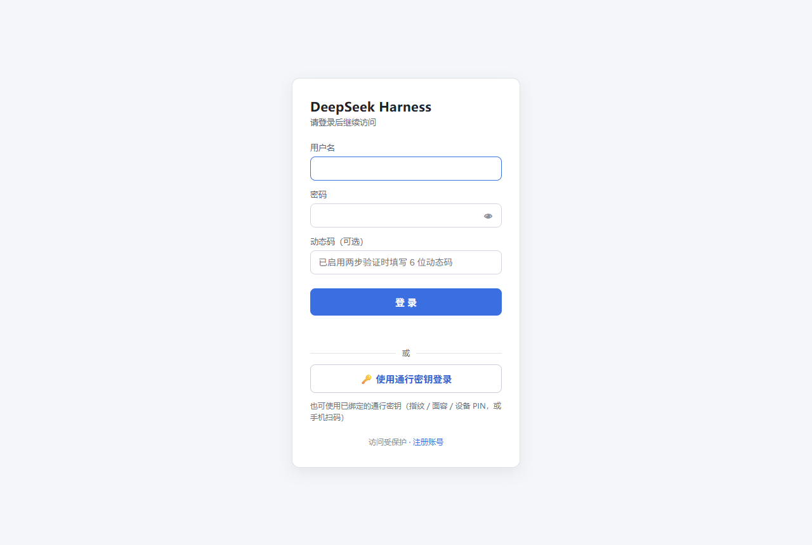
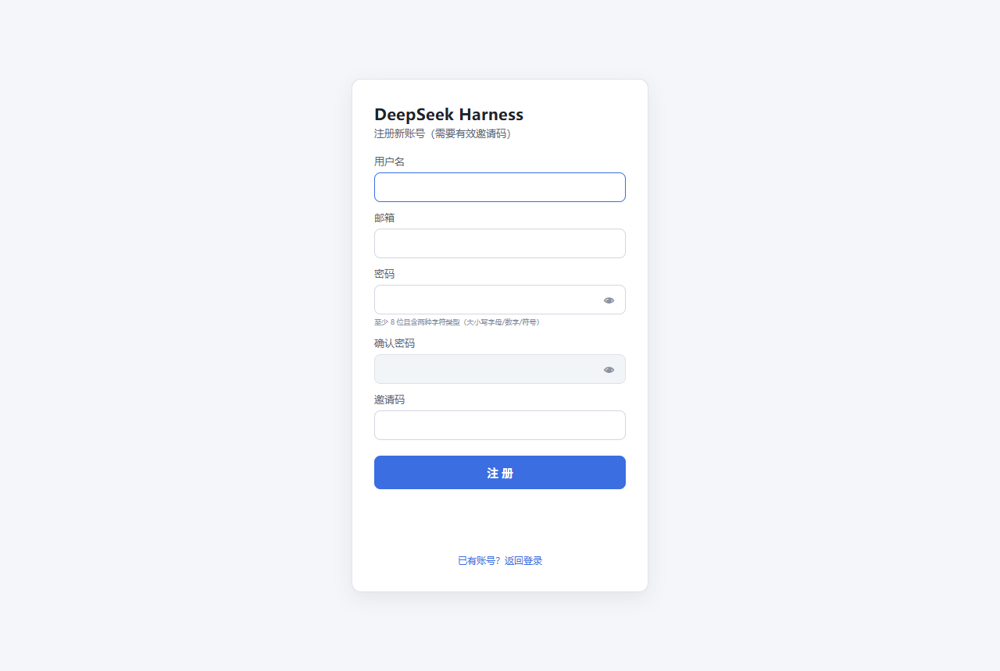
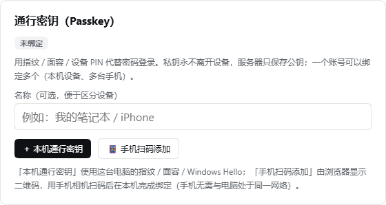
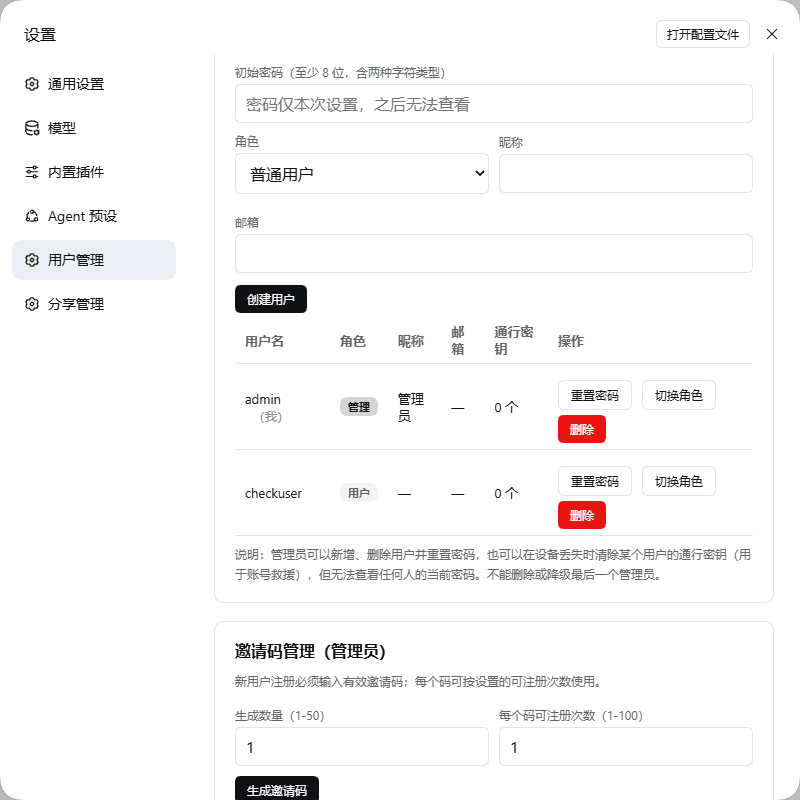
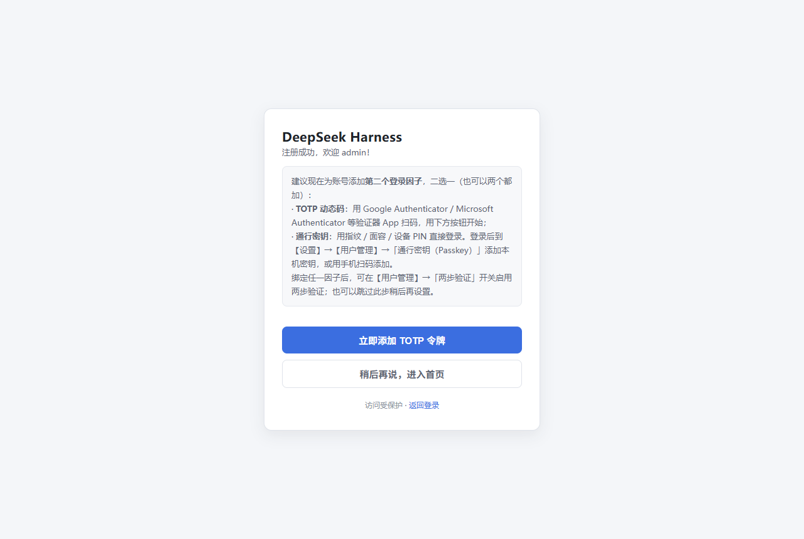
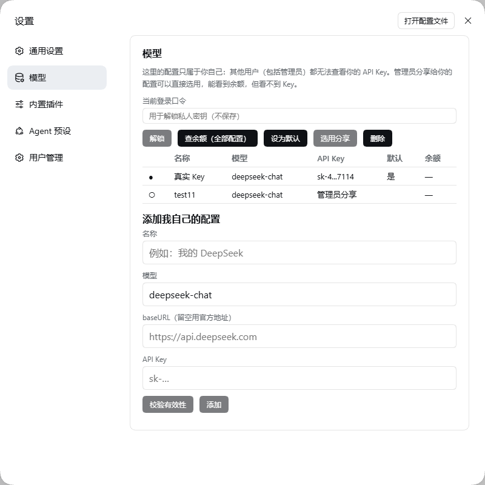
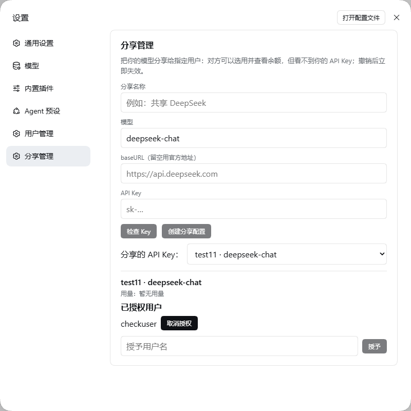

# dsh-ui-auth — DSH Web UI 认证网关插件

> **面向：**首次接触本插件的用户。

[](https://awesome-dsh-plugin.com)
[](https://www.npmjs.com/package/dsh-ui-auth)
[](https://www.npmjs.com/package/dsh-ui-auth)
[](https://deepwiki.com/0QwQ0/dsh-ui-auth)

## 🔴 兼容性提示：legacy 版本（DSH 0.1.1-rc.2）的支持已于 v0.7.0 结束


v0.7.0 起本插件**只跟随 DSH 的新版本开发**（目标版本 `0.2.0-rc.2`），
legacy 传输线（dotted `/api/<a>.<b>` + `apiProxy`）的代码已**完全移除**：
宿主未提供现代传输能力时插件会 **fail-closed**（认证网关不建立、面板不可访问并输出明确错误），
**不会**退回旧传输线，更不会降级成无门放行。
若 DSH 后续架构有大变动，我会**提前声明**该版本的支持结束时间，不会突然中断。
仍在使用 0.1.1-rc.2 的部署请在此之前按 [DSH 版本兼容性](#dsh-版本兼容性) 一节规划升级。

给 DeepSeek Harness（DSH）的 Web UI 加一道**用户名 / 密码登录门**：未登录时无法访问任何页面、
API 或 WebSocket 通道；登录后可管理用户、邀请码、两步验证（TOTP）与**通行密钥（Passkey）**，
并按登录用户隔离会话数据。

适用场景：把 DSH 面板暴露到内网或公网时，需要一个前置认证层，并希望不同使用者之间互不可见。

## 文档导航（按角色）

本 README 只讲**怎么装、怎么登录、怎么用**。更深的主题按你的角色分流（完整清单见 [docs/INDEX.md](docs/INDEX.md)）：

| 你的角色 | 去哪读 |
|---|---|
| 第一次用，只想跑起来 | 本文往下读即可 |
| 负责部署与运行 | [运维手册](docs/OPERATIONS.md)（环境变量、备份、升级、排障） |
| 做安全审计 | [安全模型](docs/SECURITY.md) + [验证证据](docs/SECURITY-VERIFICATION.md) |
| 要升级 DSH / 做集成 | [0.2.0 兼容性](docs/DSH-0.2.0-COMPATIBILITY.md) |
| 想读代码 / 提 PR | [架构](docs/ARCHITECTURE.md) + [贡献指南](CONTRIBUTING.md) |

## 特性一览

- **全接口拦截**：在 DSH 路由分发之前包装其 HTTP 服务器，覆盖 `/api/*`、`/plugins/*`、HMR、
  SPA fallback 与 WebSocket 升级通道，没有旁路。未登录时页面请求 302 跳登录页、API 返回 401、
  WS 升级直接断开；登录后原请求原样透传。
- **登录页与注册页**：**中文 / English 双语**，跟随 DSH 的语言设置自动切换（见[多语言](#多语言i18n)）；
  登录成功写入会话 Cookie（HttpOnly、SameSite=Strict、12 小时滑动续期），**Cookie 名按实例唯一**
  （同机多实例不会互相踢下线）；注册需**邮箱 + 用户名 + 密码 + 有效邀请码**，注册成功自动登录并引导绑定 TOTP。
- **用户管理**：所有用户可改自己的昵称/邮箱/密码并管理自己的 TOTP 与通行密钥；管理员可增删用户、
  重置密码、切换角色、生成/撤销邀请码、清除某人的通行密钥。**任何人都无法查看他人的当前密码**。
- **两步验证（TOTP）**：RFC 6238，可用 Google / Microsoft Authenticator 扫码绑定，也支持手动输入密钥；
  启用后登录需「密码 + 动态码」（账号未绑定 TOTP 时，第二步改用通行密钥）。
- **通行密钥（Passkey / WebAuthn）**：用指纹、面容或设备 PIN 代替密码登录，一个账号可绑定多个
  （本机密钥 + 手机密钥）。支持**不输入用户名**的一键登录；手机可用浏览器显示的二维码扫码绑定。
  私钥永不离开用户设备，服务器只保存公钥。
- **模型与 API Key 按用户隔离（v0.7.0）**：每个用户在【设置】→【模型】里管理**只属于自己的** provider/
  模型/Key；私有 Key 用**口令派生密钥**信封加密（服务端在未解锁时**无法解密**），管理员**在任何情况下**
  都读不到他人的私有配置。管理员可把自己的模型**分享**给指定用户——对方可选用、**可看余额**、**看不到 Key**，
  撤销立即失效。**未配置即阻断**（不回退部署级）。
- **按用户隔离**：会话与工作区在创建时记录归属；普通用户的会话/工作区列表只显示自己的，
  直连他人会话返回 403，管理员不受限。
  **直播通道（WebSocket）**：0.2.0 客户端把它当作主连接通道且普通用户也需要，因此网关校验会话后
  **把升级转交宿主**；该通道上的逐帧按用户过滤尚未实现，**互不信任的多用户部署请先读[已知边界](#已知边界v070)**。
- **登录防护**：密码 PBKDF2-HMAC-SHA256（每用户随机盐、60000 轮、常量时间比较）、
  密码策略「≥8 位且至少两种字符类型」、按来源 IP 的失败锁定、认证响应一律 `Cache-Control: no-store`；
  通行密钥使用一次性短时挑战、严格的来源/RP ID 校验与签名计数器回退检测。
- **修改密码（引导式）**：需先通过「当前密码」校验才解锁新密码输入；新密码实时给出强度三档
  （红/黄/绿 + 荧光），确认框在强度达标后解锁并实时比对。
- **多语言（i18n）**：界面文案中/英双语，跟随 DSH 的 locale 服务即时切换（客户端订阅 `locale/change`，
  服务端渲染页按 `Accept-Language`），详见[多语言](#多语言i18n)。
- **会话与审计**：会话可跨重启恢复（磁盘只存 Token 的 SHA-256 哈希）；管理员操作与越权尝试
  追加写入 `dsh-ui-auth-audit.jsonl`（JSONL 审计文件）。

## 环境要求

| 项 | 要求 |
|---|---|
| DSH | **`>=0.2.0-rc.2 <0.3.0`**（web profile）。v0.7.0 起**只支持 0.2.0 线**——legacy 的 `0.1.1-rc.2` 传输线已移除，失去现代传输能力时插件 **fail-closed**（面板不可访问并打印明确错误），详见[兼容性矩阵](docs/DSH-0.2.0-COMPATIBILITY.md) |
| Node.js | `^22.19.0 || >=24.0.0`（与 DSH 一致） |
| 运行时依赖 | `qrcode`（生成 TOTP 二维码）、`ws`（流式通道）与 `@simplewebauthn/server`（通行密钥服务端校验），安装时自动获取，无需手动构建 |
| 浏览器 | 通行密钥需要 Chrome / Edge / Safari / Firefox 等支持 WebAuthn 的现代浏览器；不支持时其余功能不受影响 |

**通行密钥对访问地址有硬性要求**（浏览器规则，插件无法绕过）：

| 访问地址 | 通行密钥 | 说明 |
|---|---|---|
| `https://你的域名` | ✅ 可用 | 推荐的生产部署方式（反代终止 TLS） |
| `http://localhost:3080` | ✅ 可用 | 本机使用请用 `localhost`，不是 `127.0.0.1` |
| `http://127.0.0.1:3080` | ❌ 不可用 | Chrome 拒绝 IP 地址作为通行密钥域（RP ID）；面板会提示改用 `http://localhost:3080` |
| `http://内网IP:3080` | ❌ 不可用 | 明文 HTTP 不是安全上下文，且 IP 不能作为 RP ID；需域名 + HTTPS |

## 安装

本包是标准的 DSH profile bundle（声明了 `dsh.bundle.patch` 与 `dsh.client`），
`dsh plugin` 会自动把它加入 profile 的 bundle 名单：

```bash
# 从 npm 安装
dsh plugin --profile web add dsh-ui-auth

# 或固定到某个 GitHub 发行版本
dsh plugin --profile web add github:0QwQ0/dsh-ui-auth#v0.7.0

# 或从本地目录安装（离线 / 二次开发）
dsh plugin --profile web add <本插件目录的绝对路径>
```

安装完成后**重启一次面板**生效（bundle 层在启动时应用）。

## 首次登录

用户表为空时，插件会自动创建管理员 `admin`，随机密码同时输出到两处：

1. 面板控制台日志（以 `[dsh-ui-auth]` 开头）；
2. 面板进程工作目录下的 `dsh-ui-auth-bootstrap.txt`。

打开面板会跳转到 `/auth/login`，用 `admin` 与上述随机密码登录。
**登录后请立即在【设置】→【用户管理】中修改密码**；任意用户改密成功后，引导文件会自动删除。

## 使用指南

### 设置面板 → 用户管理

- **所有用户**：修改自己的昵称、邮箱、密码；绑定/移除自己的 TOTP 令牌；添加/重命名/删除自己的
  通行密钥；开关两步验证。
- **管理员**：新增/删除用户、重置他人密码、切换角色、生成与撤销邀请码（可查看每个码的
  已用次数与剩余次数）、移除任意用户的 TOTP、清除任意用户的通行密钥（设备丢失时救援）。
- **保护规则**：不能删除或降级最后一个管理员，不能删除自己；改密或删除用户后，其其他会话立即失效。

### 修改密码（引导式校验）

【用户管理】→ 修改密码：先输入当前密码，**离开该输入框时自动校验**；通过则边框变绿（2px 向外荧光）
并解锁下面两个输入框，失败则变红且保持锁定。新密码**实时**评估强度：不满足=红、刚满足=黄、很强=绿；
只有在**至少黄色**时才解锁「确认新密码」，并实时比对（不匹配红、匹配绿）。注册页采用同一套规则。

### 注册与邀请码

注册入口在登录页的「注册账号」。新用户需要管理员事先在【用户管理】→【邀请码管理】中生成的**有效邀请码**；
每个码可设置 1–100 次的注册次数，可随时撤销。邮箱目前只做格式填写、不校验真实性，注册后可在用户管理中修改。

### 两步验证（TOTP）与通行密钥（Passkey）

两步验证可以用两种因子满足：**TOTP 动态码**或**通行密钥**。绑定任一种后即可在
【用户管理】→「两步验证」用开关启用；开关打开后，登录方式如下（通行密钥**始终**可直接登录，
与两步验证开关无关）：

| 账号状态 | 可用的登录方式 |
|---|---|
| 两步验证关闭 | 用户名 + 密码；通行密钥 |
| 两步验证开启，已绑定 TOTP | 用户名 + 密码 + 动态码；通行密钥 |
| 两步验证开启，只绑定了通行密钥 | 用户名 + 密码 + 通行密钥；通行密钥（可不填用户名） |

> 0.6.4 起**移除了「免密 + 动态码」登录**：只有动态码、没有密码的登录请求一律被拒绝。
> 免密入口统一收敛到通行密钥。

**TOTP**：在【用户管理】→「两步验证（TOTP）」生成密钥，用验证器 App 扫码（或手动输入密钥 /
otpauth 链接）后输入 6 位动态码完成绑定。动态码错误同样计入失败锁定；移除令牌需要当前动态码，
管理员可移除任意用户的令牌。

**通行密钥**：在【用户管理】→「通行密钥（Passkey）」中添加，同一个账号可以绑定多个：

- **＋ 本机通行密钥**：使用这台电脑的 Windows Hello / Touch ID / 设备 PIN；
- **📱 手机扫码添加**：浏览器会显示二维码，用手机相机扫码后在本机完成绑定（手机无需与面板处于同一网络，
  也不需要手机能访问面板）；
- 绑定后登录页会出现「🔑 使用通行密钥登录」，点击即可**不输入用户名与密码**直接登录；
  也可以照常输入用户名密码，在第二步提示时用通行密钥完成验证。

安全约定：通行密钥的私钥**永不离开设备**，服务器只保存公钥与名称等公开信息；添加、重命名、删除
通行密钥都需要先确认当前密码（两步验证开启时还需动态码或一次已有通行密钥的确认）；
为避免账号被锁死，两步验证开启且只剩一个通行密钥时不允许删除它——请先绑定 TOTP 或先关闭两步验证。
设备丢失时，管理员可在【用户管理】中「清除通行密钥」救援。

### 普通用户能看到什么

同一套权限策略在服务端逐端点生效，界面只是它的呈现：

| 设置页 | 普通用户 |
|---|---|
| 用户管理 | ✅ 完整可用（改自己的资料/密码、TOTP、通行密钥、两步验证；管理员额外有用户与邀请码管理） |
| Agent 预设 | ✅ 可查看预设清单、查看本会话所用预设、为自己会话选择预设；**创建/删除预设仅管理员** |
| 插件 | ✅ 可查看本部署已安装插件的清单；**安装/卸载/启停插件、单个插件的设置与密钥仅管理员** |
| 通用设置 | 可查看；**写入部署级设置仅管理员** |
| 模型 | ✅ 管理**自己的**模型与 API Key（私有、服务端不可解密）；管理员分享的可选用并看余额，看不到 Key |

需要放开某项的部署，可由宿主插件通过 `uiAuth.registerPolicy()` 逐条登记，见
[docs/DSH-0.2.0-COMPATIBILITY.md](docs/DSH-0.2.0-COMPATIBILITY.md)。

### 数据隔离

DSH 本身按单用户设计（会话、工作区是机器级数据）。本插件按**登录用户**隔离：

- 会话/工作区创建时记录归属；列表与搜索接口在响应侧过滤（含工作区内会话与归档会话）；
- 直接访问非属主对象（如他人的会话内容、重命名、提示词）返回 403；会话导出仅限属主；
- 会话/工作区的 REST 与列表接口按属主过滤——普通用户读不到他人会话（`session/list` 只回自己的，直连他人 403）；
- **直播通道（WebSocket）**：0.2.0 客户端以其为主连接通道且普通用户也需要，故网关校验会话后**转交宿主**；
  该通道上的**逐帧按用户过滤尚未实现**（旧的自研 mux 与 0.2.0 协议不兼容，已停用），详见[已知边界](#已知边界v070)；
- 管理员可见全部数据；插件启用**之前**已存在的旧数据默认归管理员。

## 模型页与密钥（v0.7.0 实际行为）

普通用户在【设置】→【模型】里管理**只属于自己**的模型与 API Key：

- **表格化**：名称 / 模型 / API Key（掩码 `前4...后4`）/ 默认 / 余额；行可点选。
- **单组按钮**：解锁、`查余额（全部配置）`（一次请求内**顺序**查询全部配置，整批只节流一次）、
  设为默认、选用分享、删除、添加；另有 `校验有效性` 在保存前探活当前填写的 Key。
- **未解锁时**：私有 Key 用口令派生密钥加密，服务端无法解密，因此余额列显示 **「需先解锁」**
  （而不是误导性的"未选择配置"）；解锁后即恢复数字。
- **管理员分享**：被授权者可选用、**可看余额**、**看不到 Key**；撤销立即失效。

管理员在【分享管理】里创建分享、按用户名授予/撤销，并查看每条分享的授权用户列表与用量；
所有分享 Key 收进**下拉菜单**，选中后才展开该 Key 的授权列表。

## 界面预览

| 登录页（含通行密钥入口） | 注册页 |
|---|---|
|  |  |

| 通行密钥（Passkey）卡片 | 用户管理页 |
|---|---|
|  |  |

| 注册成功引导页（绑定第二个因子） | 模型页（按用户，v0.7.0 表格化） |
|---|---|
|  |  |

| 分享管理（管理员，v0.7.0） |
|---|
|  |

> 截图由 `node test/shot.mjs`（基础页）与 `node test/shot-features.mjs`（模型页 / 分享管理）在**一次性实例**上生成（见脚本头部的环境变量说明），
> 因此图中不含任何真实账号数据。通行密钥相关界面必须在 `localhost` 或域名 + HTTPS 下才会完整渲染。

## 卸载

```bash
dsh plugin --profile web remove dsh-ui-auth
# 重启面板后网关、设置面板与客户端模块全部消失；profile 的依赖与 bundle 名单自动还原
```

卸载**不会**删除账号数据（防误删）；如需一并清空，见上一节。

## 安全说明与已知边界

- **密码与会话**：PBKDF2-HMAC-SHA256（随机盐、60000 轮、常量时间比较）；密码策略为
  「≥8 位且至少两种字符类型」；会话 Token 仅以 SHA-256 哈希落盘，登出、改密或删除用户后相关会话立即失效。
- **Cookie**：会话 Cookie 为 HttpOnly + SameSite=Strict，且**名字按实例唯一**（`dsh_auth_<DSH_HOME 短哈希>`，
  因为浏览器 Cookie 不区分端口，固定名会让同机多实例互相踢下线）；在 TLS 直连或（仅在信任反代时）
  `X-Forwarded-Proto: https` 的通道下自动追加 `Secure`。
- **公网部署建议**：放在 HTTPS 反向代理之后，由代理终结 TLS 并保留 Host；DSH 自身可监听
  `127.0.0.1` 或内网。反代场景请按上文开启 `DSH_AUTH_TRUST_PROXY=1`，否则限流会按代理 IP 聚合。
- **会话持久化带来「记住登录」**：未过期的会话在面板重启后自动恢复；若你的安全要求是每次重启都必须重新登录，
  可在停止面板后删除 `dsh-ui-auth-sessions.json`。
- **升级提示**：从 0.5.1 之前的版本升级时，旧版**明文**会话记录不再恢复，所有用户需要重新登录一次。
- **与 DSH 自带机制的关系**：DSH 对 `/api` 的 DNS-rebinding 信任栅栏**明确不是认证**；
  本插件才是前置认证层，两者叠加使用。
- **隔离强度的上限**：本插件按登录用户隔离 DSH 的会话/工作区数据；它不改变 DSH 自身的进程权限模型，
  也不能隔离第三方插件自己的数据。多租户级别的强隔离需要 DSH 侧的支持。
- 更完整的安全分析（威胁模型、用例矩阵、残余风险与部署加固清单）见 [SECURITY.md](docs/SECURITY.md)。

> **已知边界（v0.7.0）**：DSH 0.2.0 的客户端把 `/api/remote.mux`（WebSocket）当作主连接通道，
> 普通用户也需要它，因此网关在**校验会话之后**把升级请求交给宿主处理——
> 代价是这条通道上的**逐帧按用户过滤**尚未实现（旧的自研 mux 与 0.2.0 客户端协议不兼容，已停用）。
> 其余通道（REST/列表接口、`/plugins/events`）仍按会话与属主把关；
> 需要在 mux 上恢复逐帧隔离的部署，请勿在此版本把面板暴露给互不信任的用户。

> **v0.7.0 实测发现并修复的问题**（均已在真实实例上验证）：
> 凭据键语法错误会让宿主起不来、R1-ii 三处接线问题、余额 fetcher 从未注入、
> **WebSocket 升级被自研 mux 接管导致设置页一直「重新连接中」**、跨实例会话 Cookie 同名互相踢下线。
> 详见 `CHANGELOG.md` 的 0.7.0 条目。

### 已知边界（v0.7.0）

- **mux 逐帧隔离**：0.2.0 的客户端把 `/api/remote.mux`（WebSocket）当作主连接通道，普通用户也需要它，
  因此网关在校验会话后把升级交给宿主；这条通道上的**逐帧按用户过滤尚未实现**（自研 mux 与 0.2.0 协议不兼容，已停用）。
  其余通道（REST/列表、`/plugins/events`）仍按会话与属主把关。**互不信任的多用户部署请暂勿暴露面板。**
- **会话 Cookie 按实例唯一**：以 `DSH_HOME` 短哈希为后缀（实例内稳定、实例间互不干扰）。
  注意：该修复在 v0.7.0 生效；同机上仍在跑 0.6.x 的实例其 Cookie 名仍旧式，跨版本仍可能互相踢。
- **查余额需要解锁**：私有 Key 为口令派生密钥加密（E2E），服务端在未解锁时无法解密，故按设计提示「需先解锁」。

## 多语言（i18n）

界面文案支持**中文 / English**，跟随 DSH 的语言设置自动切换（无需重启面板）：

| 层 | 取语言的方式 |
|---|---|
| 客户端界面 | 用 DSH 的 locale 服务：`ctx.locale.register/bind` 注册并绑定词典，订阅 `locale/change` 即时重渲染 |
| 服务端渲染页（登录 / 注册 / 注册成功） | 用户偏好缺省时按 DSH 的规则**交给浏览器**，即读取请求的 `Accept-Language` |
| 服务端消息（RPC 错误等） | 与页面同一套词典，在统一出口处翻译 |

实现要点：

- 词典分两层：**语义键**（`src/i18n.ts`，用于逐点 `t()`）与**短语表**（`src/i18n-phrases.ts`，约 320 条），
  后者按「中文原文 → 英文」做**子串替换**，因此能覆盖拼装式文案（如 `当前登录：` + 用户名）；
- 客户端替换只作用于**我们自己的区域**（`.dshua` 面板与设置对话框），不触碰宿主其它界面，且**记住原文**可双向还原；
- 替换按**长键优先**，避免短词吃掉长词；未收录的文案保持中文原文，可增量补充而不会出现空白；
- 语言探测以 DSH 绑定的 `t()` 为准（最权威），快照与 `documentElement.lang` 仅作兜底，且**每次替换前即时探测**：
  DSH 的 locale 同步可能晚于插件加载，缓存会导致用错语言。

自检：`node test/i18n.test.mjs`（词典完整性 / 替换行为 / Accept-Language 解析）与
`DSH020_URL=... node test/live-i18n-check.mjs`（真实实例上切 en 再切回 zh 的端到端检查）。

## 配置与运维

环境变量、数据落盘位置、备份恢复、升级回滚与排障，全部收在 **[运维手册](docs/OPERATIONS.md)**（面向部署者）。
这里只强调两点：**首次启动生成的 `dsh-ui-auth-bootstrap.txt` 用完即删**；
**宿主缺少现代传输能力时插件会 fail-closed**（面板不可访问），这是有意设计而非故障。

## DSH 版本兼容性

v0.7.0 起**只支持 modern 传输线**（DSH `0.2.0-rc.2` 线），legacy 传输线已完全移除。
下表按"目标版本 / 中间版本 / legacy"三档给出实测结论（表格随每次实测更新）：

| 档位 | DSH 版本 | 结论 | 说明 |
|---|---|---|---|
| **目标** | `0.2.0-rc.2` | ✅ compatible | 唯一的目标版本；启动即硬前置校验，端点面与页面均按此版本实测 |
| 中间 | 全部已实测：`0.2.0-rc.1`、`0.1.7-rc.2`、`0.1.7-rc.1`（✅ 38/38）；`0.1.6-alpha.2`（37/38）、`0.1.5-rc.3`、`0.1.5-rc.2`、`0.1.5-rc.1`（34/38，缺 0.2.0 独有端点，属能力收窄）；`0.1.6-alpha.1` ❌ 宿主自身无法启动（上游缺陷） | 见左 | 中间版本不会因为缺能力而放行：缺失现代传输能力即 fail-closed；端点缺失只表现为该页不可用（404） |
| legacy | `0.1.1-rc.2` | ❌ **已移除** | 缺失 `connection.authorizeIndex` 时**fail-closed**：认证网关不建立、面板不可访问并输出明确错误，绝不降级为无门放行 |

**注意**：宿主未提供现代传输能力时，插件**不会**退回旧传输线，而是以"明确拒绝"的方式停摆
（宁可不可访问，也不能无门暴露）。这也意味着升级到 v0.7.0 前请先确认 DSH 版本。

普通用户在 modern 线上的可达面同样按用户裁剪：模型与 API Key 各自独立（见
[按用户隔离的模型与 API Key](docs/RBAC-MODEL-PROFILES.md)），不能创建 workspace（属部署方能力），
也不能写入任何设置命名空间；需要放开时可由宿主插件通过 `uiAuth` 接口登记策略。
端点清单、收紧项与验证证据见 [docs/DSH-0.2.0-COMPATIBILITY.md](docs/DSH-0.2.0-COMPATIBILITY.md)。

## 常见问题

**忘记管理员密码怎么办？**
删除 `~/.dsh/.credentials.yaml` 中 `dsh-auth/admin`（及其对应的哈希记录），重启面板后会重新生成 `admin`
与新的随机密码（原账号的 TOTP、通行密钥与资料会丢失）。其他用户的密码可由管理员在用户管理中重置。

**删掉的用户想用同一个名字重建，提示「用户名已存在」？**
这是有意设计：被删除的用户名会写入**永久墓碑**，同名账号不能重建，避免新账号继承旧账号留下的
会话归属、邀请码记录等历史残留。请换一个用户名，或按上面的方法清空整张用户表后重新引导。

**绑定的通行密钥设备丢了怎么办？**
两个办法：① 若该账号还绑定了 TOTP，用「密码 + 动态码」登录后在【用户管理】里删除丢失的通行密钥；
② 请管理员在【用户管理】→ 对应用户行点「清除通行密钥」。管理员自己的通行密钥若全部丢失且未绑定 TOTP，
只能按上一条重置 `admin` 记录（这也是「两步验证开启时不允许删除最后一个通行密钥」的原因）。

**通行密钥按钮不可用 / 提示改用 localhost？**
浏览器不允许把 IP 地址当作通行密钥域。请用 `http://localhost:3080` 打开面板，或给面板配一个域名并走 HTTPS。
面板会直接给出应该使用的地址。

**手机扫码绑定后，手机上也能直接登录面板吗？**
可以。手机通行密钥是「可同步/混合」凭据：手机浏览器打开同一地址（必须同样是域名或 `localhost`）即可用
指纹/面容直接登录；无需电脑在场。

**重启面板后需要重新登录吗？**
不需要。未过期的会话会自动恢复；只有在从 0.5.1 之前的版本升级时，旧会话记录会失效一次。

**普通用户看不到「模型」页，是故障吗？**
v0.7.0 起**不是**这样：每个用户在【设置】→【模型】里管理**自己的**模型与 API Key。
若你看到的是旧行为（提示"仅管理员可访问"），说明插件版本低于 0.7.0。

**登录限流把所有人都算成同一个来源？**
说明面板前面有反向代理。按上文开启 `DSH_AUTH_TRUST_PROXY=1`，限流将按真实客户端 IP 计数。

**邀请码用完了 / 想关闭注册？**
注册必须持有效邀请码，因此不生成邀请码即等于关闭注册；管理员可随时生成或撤销。

**可以只要认证、不做数据隔离吗？**
当前版本始终启用按用户隔离。需要自定义策略的部署可通过宿主插件调用 `uiAuth` 接口（见兼容性文档）。

## 开发

源码为 TypeScript，**构建产物一并提交**（DSH 直接读取仓库，因此运行与安装不需要构建）：

```bash
npm ci                 # 安装开发依赖
npm run typecheck      # 宿主（tsconfig.json）与客户端（tsconfig.client.json）两套严格类型检查
npm run build          # src/*.ts → lib/*.js，并构建客户端 bundle（内含契约自检）
npm test               # 全量回归（构建 + 安全套件 + 策略/加解密 + 冒烟 + 登录页/端点）
npm run verify:clean   # 校验 lib/ 与 src/ 一致（改源码后必须提交重新构建的产物）
```

常用的针对性检查：

| 命令 | 用途 |
|---|---|
| `npm run store:check` | 商城契约门禁（依赖声明、权限信号、打包内容） |
| `npm run test:compat:0.2.0` | 真实 DSH 0.2.0 实例端到端（38 项） |
| `npm run test:compat:matrix` | 多版本兼容矩阵（逐版本起一次性实例） |
| `npm run test:i18n:live` | 语言切换端到端（en ↔ zh） |
| `npm run docs:matrix` | 由安全套件的 **JSON 结果**重建安全报告 §2 |

**模块职责与测试分层见 [架构文档](docs/ARCHITECTURE.md)；开发环境、提交纪律与文案规范见[贡献指南](CONTRIBUTING.md)。**
（README 不再重复模块表，避免两处漂移。）

